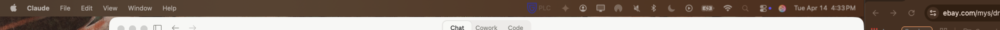
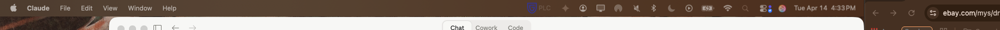
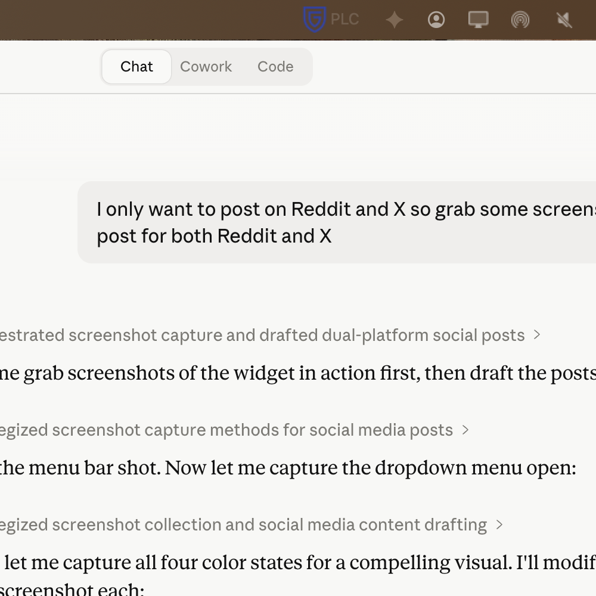

# 🧠 Claude Context Tracker

**A macOS menu bar widget that tells you when Claude is getting dumber.**

Every existing Claude tracker tells you when you'll hit your *rate limit*. This one tells you when your *conversation quality* is degrading — a fundamentally different and more useful signal.


### Context Rot Progression in Your Menu Bar

| 🟢 Green (0-35%) | 🟠 Orange (35-60%) | 🟡 Yellow (60-80%) | 🔴 Red (80%+) |
|---|---|---|---|
|  |  |  |  |
| Full quality | Mild degradation | Significant rot | Start fresh |



---

## The Problem

Claude's 200K token context window is not a binary on/off switch. Long before you hit the limit, **context rot** silently degrades response quality:

- Information buried in the middle of your conversation gets ignored
- Reasoning accuracy drops as context fills
- Code generation quality deteriorates
- The model starts "forgetting" instructions from earlier in the chat

**You can't feel this happening.** Claude doesn't warn you. The responses just quietly get worse.

## The Research

The warning thresholds in this tool aren't arbitrary — they're calibrated to peer-reviewed context rot research:

| Zone | Range | What's Happening |
|------|-------|-----------------|
| 🟢 Green | 0–35% (0–70K tokens) | Full quality. Strong recall across all positions. |
| 🟠 Orange | 35–60% (70K–120K tokens) | Mild degradation beginning. Middle-content recall weakening. |
| 🟡 Yellow | 60–80% (120K–160K tokens) | Significant rot. Reasoning and code accuracy dropping. |
| 🔴 Red | 80%+ (160K+ tokens) | Severe degradation. Start a new conversation. |

**Key findings from the research:**

- **Chroma (2025)** — Tested 18 frontier models including Claude, GPT-4.1, and Gemini 2.5. Every model exhibited measurable performance degradation at every input length increment. Accuracy dropped 30%+ for information positioned in the middle of the context window. ([research.trychroma.com/context-rot](https://research.trychroma.com/context-rot))

- **Stanford "Lost in the Middle" (TACL 2024)** — Accuracy declined from 70-75% for information at the start/end of context to 55-60% for middle-positioned content — a 15-20 percentage point drop based entirely on position, not content quality.

- **AgentPatterns / RULER Study** — Degradation onset is closer to an absolute token threshold (~32K-100K) than a fixed percentage of window size. Only half the models tested maintained satisfactory performance at 32K tokens. ([agentpatterns.ai](https://agentpatterns.ai/context-engineering/context-window-dumb-zone/))

- **Manus (Context Engineering)** — Production agent systems trigger context summarization at 128K tokens (~64% of 200K) to maintain quality. ([philschmid.de](https://www.philschmid.de/context-engineering-part-2))

- **OpenCode Community** — Developers reported Claude quality drops significantly after ~50% of context, leading to a feature request for configurable compaction thresholds.

## How It Works

1. **Cmd+A → Cmd+C** in your Claude conversation (copies the full chat)
2. Click the **CW** widget in your menu bar → **"Replace from Clipboard"**
3. See your estimated context usage with color-coded quality warnings

That's it. Two moves for a pulse check on conversation quality.

## Features

- **🎯 Research-calibrated warnings** — Thresholds based on actual context rot studies, not guesses
- **📊 Visual progress bar** — `🟢 24% ▰▰▱▱▱▱▱▱` visible in your menu bar at all times
- **💬 Multi-conversation tracking** — Switch between Claude chats, each with independent counts
- **⌨️ Global hotkey** — Ctrl+Shift+C to update without clicking (requires Accessibility permission)
- **➕ Quick estimate** — +2K button for rough tracking between full clipboard counts
- **💾 Persistent state** — Picks up where you left off across restarts
- **🚀 Auto-start** — LaunchAgent included for login auto-start

## Installation

### Quick Start

```bash
# Clone the repo
git clone https://github.com/papithomas/claude-context-tracker.git
cd claude-context-tracker

# Create a virtual environment and install dependencies
python3 -m venv venv
source venv/bin/activate
pip install rumps pynput

# Run it
python3 context_tracker.py
```

### Auto-Start on Login (Recommended)

```bash
# Find your Python path
which python3

# Create the LaunchAgent (edit paths if needed)
cat > ~/Library/LaunchAgents/com.paully.claude-context-tracker.plist << 'EOF'
<?xml version="1.0" encoding="UTF-8"?>
<!DOCTYPE plist PUBLIC "-//Apple//DTD PLIST 1.0//EN" "http://www.apple.com/DTDs/PropertyList-1.0.dtd">
<plist version="1.0">
<dict>
    <key>Label</key>
    <string>com.paully.claude-context-tracker</string>
    <key>ProgramArguments</key>
    <array>
        <string>/path/to/your/venv/bin/python3</string>
        <string>/path/to/claude-context-tracker/context_tracker.py</string>
    </array>
    <key>RunAtLoad</key>
    <true/>
    <key>KeepAlive</key>
    <false/>
    <key>StandardOutPath</key>
    <string>/tmp/claude-context-tracker.log</string>
    <key>StandardErrorPath</key>
    <string>/tmp/claude-context-tracker.err</string>
</dict>
</plist>
EOF

# Load and start
launchctl load ~/Library/LaunchAgents/com.paully.claude-context-tracker.plist
launchctl start com.paully.claude-context-tracker
```

### Optional: Global Hotkey

The Ctrl+Shift+C hotkey requires macOS Accessibility permission:

**System Settings → Privacy & Security → Accessibility** → Add Python (or your terminal app).

Without this, everything still works — just use the menu bar click instead.

## Usage Guide

| Action | What It Does |
|--------|-------------|
| **Replace from Clipboard** | Overwrites token count with clipboard content. Best for full-conversation paste (Cmd+A → Cmd+C). |
| **Count from Clipboard** | Adds clipboard tokens to existing count. For partial pastes. |
| **+2K Quick Estimate** | Rough increment per message exchange. Fast but approximate. |
| **Conversations** | Switch between tracked chats. Each maintains independent counts. |
| **Reset Active Chat** | Zeros out the current conversation. Use when starting fresh. |

### When to Act

- **🟢 Green (0-35%)** — You're good. Full quality responses.
- **🟠 Orange (35-60%)** — Be aware. Consider whether you need everything in this conversation.
- **🟡 Yellow (60-80%)** — Quality is noticeably dropping. Plan to wrap up or start fresh with a context handoff.
- **🔴 Red (80%+)** — Start a new conversation. Summarize key context and carry it over.

## How It Differs From Other Claude Trackers

| Tool | What It Tracks |
|------|---------------|
| ClaudeUsageBar, ClaudeMeter, Claude Usage Widget | **Plan usage limits** — how many messages/tokens you've used of your subscription quota |
| Claude Context Bar (VS Code) | **Claude Code context** — token counts in coding sessions |
| **Claude Context Tracker (this tool)** | **Conversation quality** — how full your context window is and when context rot is degrading responses |

The existing tools answer: *"Am I about to get rate limited?"*
This tool answers: *"Is Claude still thinking clearly?"*

## Accuracy & Limitations

**This is an estimate.** The tool uses a ~3.5 characters-per-token heuristic, which is reasonable for mixed English text and code but not exact. Expect ±10-15% variance from Claude's actual tokenizer. The system prompt, tool definitions, and memory injections that Claude loads behind the scenes are also not captured by clipboard — so your actual context usage is somewhat higher than what this tool shows.

That said, the directional signal is what matters. When the bar turns yellow, your conversation is getting long enough that quality degradation is real.

## Roadmap

- [ ] Native Swift/SwiftUI rewrite for drag-and-drop install
- [ ] Homebrew Cask distribution
- [ ] Configurable token limits (200K / 1M for API users)
- [ ] Integration with Claude's actual tokenizer for higher accuracy
- [ ] Notifications at threshold crossings
- [ ] Cross-platform support (Windows/Linux via Tauri)

## Contributing

Contributions welcome. If you're interested in:

- **Swift rewrite** — The biggest impact would be a native macOS app that doesn't require Python
- **Better token estimation** — Integration with Anthropic's tokenizer or tiktoken
- **Research citations** — Additional context rot studies to refine thresholds
- **Cross-platform** — Tauri or Electron port for Windows/Linux

Open an issue or submit a PR.

## License

MIT — see [LICENSE](LICENSE) for details.

---

*Built by [Paul Thomas](https://github.com/papithomas). Thresholds calibrated with research from Chroma, Stanford NLP, Manus, and the AgentPatterns community.*
